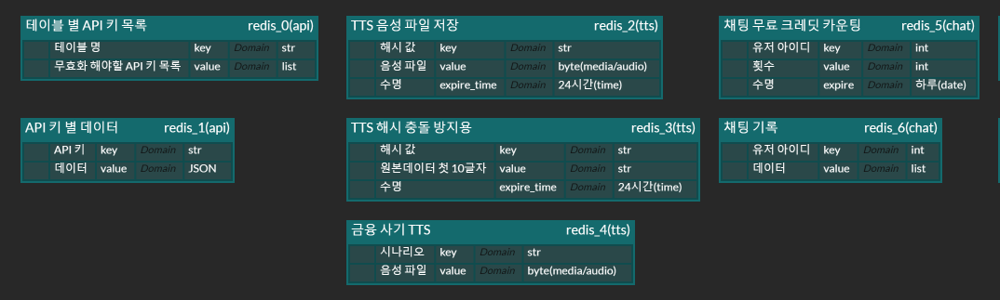
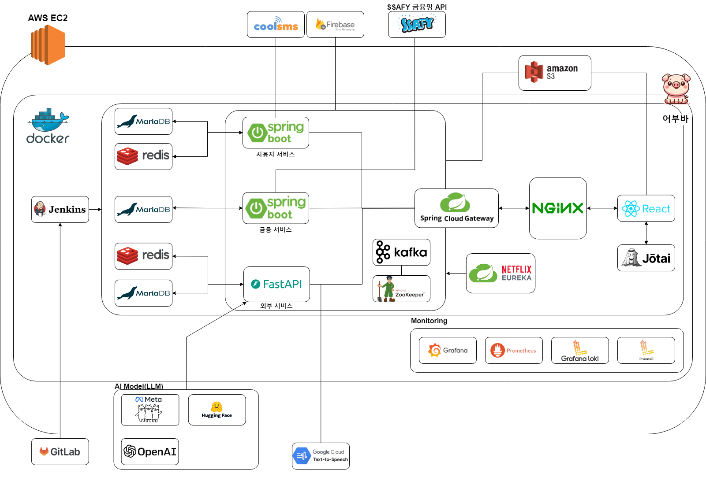
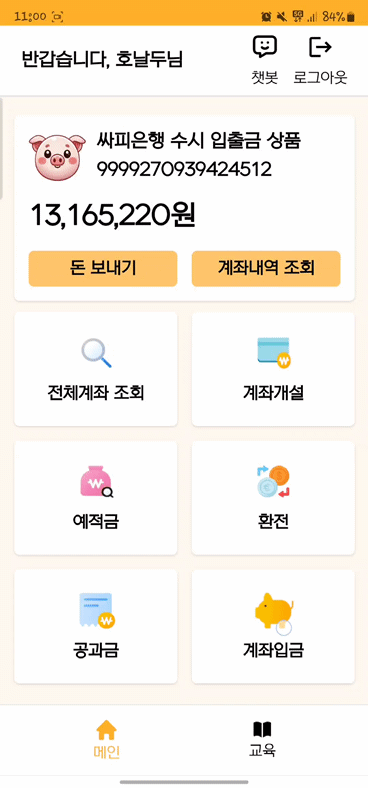
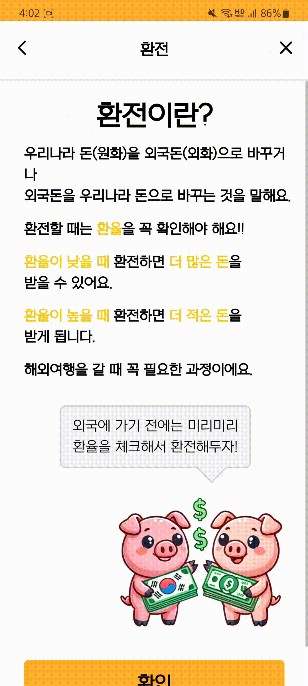
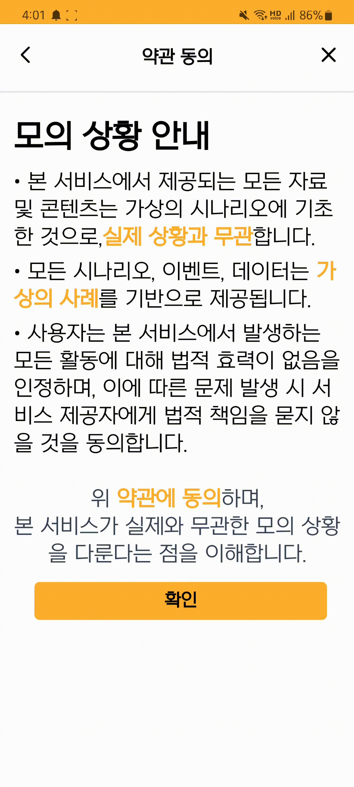

## 어부바 : 어르신 부자되는 바른 금융 생활
<div align="center">
    
</div>

# 📌 어부바 (Uhbooba) : 시니어 모바일 뱅킹 교육 서비스

어부바는 금융 지식이 부족한 시니어층을 위한 맞춤형 금융 교육 서비스입니다. 시니어들은 어부바를 통해 금융 상품을 쉽게 이해하고 안전하게 모의로 활용할 수 있습니다. 계좌 관리, 예금, 적금, 환전, 공과금 납부 등 다양한 금융 서비스를 실습하며 익히고, 금융 사기 예방 교육과 퀴즈를 통해 실생활에서 발생할 수 있는 금융 위험을 예방할 수 있습니다. 

> 어부바와 함께 금융 이해도를 높이고 안전한 금융 생활을 시작해보세요!

---

## 📋 목차

1. [**서비스 개요**](#서비스-개요)
2. [**프로젝트 기간**](#프로젝트-기간)
3. [**팀원 소개**](#팀원-소개)
4. [**주요 기능**](#주요-기능)
5. [**차별점**](#차별점)
6. [**기대 효과**](#기대-효과)
7. [**장기적 확장 방향**](#장기적-확장-방향)
8. [**소개 영상**](#소개-영상)
9. [**기술 스택**](#기술-스택)
10. [**프로젝트 구성도**](#프로젝트-구성도)
11. [**시연 영상**](#시연-영상)
11. [**포팅 메뉴얼**](#포팅-메뉴얼)
12. [**개발환경 빌드 및 실행 방법**](#개발환경-빌드-및-실행-방법)
13. [**API 명세**](#api-명세)

---

## 서비스 개요

### 배경
디지털 금융 환경이 빠르게 발전하면서, 시니어층은 변화하는 금융 시스템에 적응하기 어려워하는 경우가 많습니다. 스마트폰을 이용한 금융 서비스가 확산됨에 따라 시니어층은 금융 상품과 서비스에 대한 이해 부족으로 인해 금융 사기나 불리한 결정을 내릴 위험이 커지고 있습니다. 이러한 문제를 해결하기 위해 시니어들이 디지털 금융 서비스를 쉽게 이해하고 안전하게 활용할 수 있는 교육 시스템이 필요합니다.

### 목적
'어부바'는 금융 지식이 부족한 시니어층을 위한 맞춤형 금융 교육 서비스로, 시니어들이 금융 상품을 이해하고 안전하게 이용할 수 있도록 돕기 위해 설계되었습니다. 어부바를 통해 시니어들은 계좌 관리, 예금, 적금, 환전, 공과금 납부 등 다양한 금융 서비스를 모의로 경험하고, 금융 사기 예방 교육을 통해 실생활에서 금융 위험을 방지할 수 있습니다.

'어부바'는 금융 교육을 통해 시니어들이 스스로 금융 자산을 안전하게 관리하고, 나아가 보다 안정적인 금융 생활을 영위할 수 있도록 돕는 것을 목표로 합니다.

> <i>안전하고 똑똑한 금융 생활, 어부바와 함께!</i>

---
## 프로젝트 기간
**2024 SSAFY 11기 2학기 특화프로젝트**

**2024.08.19(월) ~ 2024.10.11(금)**

---

## 팀원 소개

| 역할 | 이름 | 담당 업무 |
| --- | --- | --- |
| Frontend | 이찬규 | 팀장, UI 개발(계좌 기능, 챗봇, 스탬프) |
| Frontend | 김지윤 | UI 개발(회원 관리, 환전, 금융퀴즈, 공과금, 금융 사기 예방, TTS) |
| Frontend | 최영빈 | UI 개발(메인화면, 예적금, 이수증, 교육영상) |
| Backend | 강유미 | 외부 서비스 개발(챗봇, 교육 영상, 금융 퀴즈, TTS, 금융 사기 예방)<br> AI |
| Backend | 김인엽 | 금융 서비스 개발(계좌, 예적금, 환전, 공과금, 거래내역) <br> 인프라 |
| Backend | 이희주 | 회원 및 인증 서비스 개발(회원 관리, SMS 인증) <br> 푸시 알림 기능 개발(Kafka, firebase) |

---

## 주요 기능

### 사용자 관리

- **사용자 회원가입 및 로그인**
    - 간편한 회원가입 및 로그인 기능 제공
    - SMS 본인 인증된 사용자만 금융 서비스를 안전하게 이용 가능

### 금융 서비스 관리

- **계좌 관리**
    - 시니어들을 위한 간편한 계좌 생성 및 관리 기능
    - 예금, 적금, 입출금 계좌를 모의로 생성하고 관리

- **예금 및 적금 관리**
    - 예금 및 적금 상품의 가입 및 관리 기능 제공
    - 중도 해지 및 만기 시 이자 계산 기능

- **환전**
    - 다양한 통화 환전 기능 제공
    - 실시간 환율 조회 및 모의 환전 서비스

- **공과금 납부**
    - 전기, 수도, 가스 등 공과금 납부 기능 제공
    - 납부 내역 관리 및 모의 공과금 결제 서비스

### 금융 교육

- **금융 사기 예방 교육**
    - 시니어들이 자주 접하는 금융 사기 유형을 교육
    - 모의 사기 사례를 통한 실습 및 피드백(실제 사례 뉴스) 제공

- **금융 상품 이해도 향상 교육**
    - 예금, 적금, 공과금 납부 등 다양한 금융 상품의 사용법 교육
    - 시니어들이 쉽게 이해할 수 있는 맞춤형 금융 교육 영상 제공

- **퀴즈 및 이수증**
    - 금융 교육 퀴즈를 통해 학습한 내용을 확인
    - 7개 금융 미션 완료 시 이수증 발급, 스탬프를 모으는 형식으로 진행
        - 로그인, 입출금 계좌 생성, 이체, 예금 가입 및 해지, 적금 가입 및 해지, 환전, 공과금 납부

- **푸시 알림**
    - 금융 활동과 관련된 푸시 알림 기능 제공
    - 계좌 이체, 환전 완료, 공과금 납부 등의 주요 금융 활동에 대한 알림을 통해 실시간으로 정보를 제공

---

## 차별점

### 1. **📚 시니어 금융 교육 플랫폼**
   - 시니어들이 금융 상품을 이해하고, 안전하게 금융 서비스를 이용할 수 있도록 금융 교육 제공

### 2. **🛡️ 금융 사기 예방 교육 및 실습**
   - 실제 금융 사기 사례 기반의 모의 실습 및 퀴즈를 통해 금융 사기에 대한 예방 능력 강화

### 3. **🔄 다양한 금융 서비스 체험**
   - 계좌 생성, 예금 및 적금, 환전, 공과금 납부 등 다양한 금융 서비스를 안전하게 모의 체험

### 4. **🎯 맞춤형 금융 교육 퀴즈 및 이수증 발급**
   - 학습한 내용을 퀴즈를 통해 확인하고, 7개 금융 미션 완료 후 이수증을 발급하여 금융 이해도 상승

### 5. **📲 실시간 금융 활동 푸시 알림**
   - 사용자의 주요 금융 활동(계좌 이체, 환전 등)에 대한 **실시간 푸시 알림** 제공
---

## 기대 효과

- **시니어들의 금융 서비스 접근성 향상**
    - 금융 지식 부족으로 인해 불편을 겪는 시니어들의 금융 서비스 접근성 개선
- **금융 상품 이해도 증대**
    - 모의 금융 서비스를 통해 예금, 적금, 환전 등 금융 상품을 쉽게 이해하고 활용할 수 있도록 지원
- **교육 효과 극대화**
    - 실습형 교육과 퀴즈를 통해 학습 효과를 극대화하고, 이수증 발급으로 성취감 제공
- **맞춤형 금융 피드백 제공**
    - 사용자의 금융 상황에 맞는 피드백을 실시간으로 제공하여 금융 위험을 사전에 예방

---

## 장기적 확장 방향

- **맞춤형 금융 솔루션 제공**
    - 시니어층의 금융 이해도에 맞춘 맞춤형 금융 상품 및 서비스 제안 기능 확대
- **금융 사기 예방 기능 강화**
    - 실시간 금융 사기 알림 및 추가 예방 교육 프로그램 개발
- **AI 기반 금융 교육 프로그램**
    - 사용자의 금융 활동 데이터를 분석하여 개인 맞춤형 금융 교육 및 서비스 제공
- **다양한 사용자 대상 확장**
    - 시니어뿐만 아니라 청소년, 초보 금융 사용자 등 다양한 금융 소외 계층에게도 금융 교육 제공

---


## 소개 영상
[](https://s3.youm.me/uhbooba/UCC.mp4)

---

## 기술 스택

### Management Tool


### IDE


### Infra


### Frontend


### Backend


### **외부 API**


### 기술적 특장점

#### **1. 클라우드 네이티브 (Cloud Native)**
   - **어부바 서비스**는 **클라우드 네이티브 아키텍처**로 설계되어, 클라우드 환경에서 효율적이고 확장 가능한 운영이 가능합니다. **Spring Cloud**와 **Eureka**로 MSA를 구성해 서비스가 독립적으로 확장/축소되며, **Amazon EC2**로 안정적인 배포와 운영을 지원합니다.

#### **2. 캐싱 (Caching)**
   - **Redis**를 활용해 사용자 정보, 금융 사기 TTS, 채팅 기록 등을 캐싱하여 서비스 성능을 극대화했습니다. 이를 통해 실시간 상호작용이 필요한 기능에서 **빠른 응답 시간**과 **원활한 사용자 경험**을 제공합니다.



#### **3. 단일 페이지 애플리케이션 (SPA)**
   - **React 기반 SPA**로 설계되어 페이지 전환 시 전체 로드 없이 필요한 부분만 업데이트합니다. **빠르고 직관적인 사용자 경험**을 제공하여 금융 정보 조회나 계좌 관리 시 최적화된 성능을 발휘합니다.

#### **4. 프로그레시브 웹 애플리케이션 (PWA)**
   - **PWA** 기술을 적용해 웹과 모바일에서 앱 설치 없이 사용 가능하며, **오프라인 모드**와 푸시 알림 기능을 통해 실시간 정보 전달이 가능합니다. 사용자는 계좌 이체, 환전 완료, 공과금 납부 등의 정보를 즉시 확인할 수 있습니다.


---

## 프로젝트 구성도

### 시스템 아키텍처



1. **AWS EC2**:
   - 어부바 서비스는 AWS EC2 인스턴스에서 호스팅됩니다. EC2는 서비스의 핵심 인프라 역할을 하며, 애플리케이션과 데이터베이스, 기타 서비스들이 이 위에서 운영됩니다.

2. **Docker**:
   - 모든 애플리케이션 컴포넌트는 Docker 컨테이너로 패키징되어 실행됩니다. 각 서비스는 컨테이너에서 독립적으로 실행되어 환경 간 일관성을 보장하며, 배포 및 스케일링이 용이합니다.

3. **Jenkins**:
   - Jenkins를 사용하여 CI/CD 파이프라인을 구축했습니다. 코드가 푸시되면 자동으로 빌드 및 테스트가 진행되며, 컨테이너화된 애플리케이션이 EC2로 배포됩니다.

4. **MariaDB**:
   - MariaDB는 각 서비스(사용자 서비스, 금융 서비스, 외부 서비스)의 데이터베이스로 사용됩니다. 각 서비스는 고유의 데이터베이스를 가지고 있으며, 데이터는 AWS EC2 내에서 안전하게 관리됩니다.

5. **Redis**:
   - Redis는 서비스의 캐싱 레이어로 활용되어, 자주 조회되는 데이터(예: 사용자 정보, 금융 사기 TTS, 채팅 기록)를 빠르게 제공함으로써 성능을 향상시킵니다.

6. **Spring Boot (사용자 서비스 및 금융 서비스)**:
   - 사용자 서비스와 금융 서비스는 Spring Boot로 구현되어 있으며, 금융 서비스는 금융 상품 조회, 입출금, 환전, 공과금 납부 등을 처리합니다. 사용자 서비스는 회원 관리, 로그인, 인증 등의 기능을 담당합니다.

7. **FastAPI (외부 서비스)**:
   - 외부 서비스는 FastAPI를 사용해 구현되었습니다. 금융 사기 예방 퀴즈 및 기타 외부 API와 상호작용하는 역할을 수행합니다.

8. **Spring Cloud Gateway 및 Netflix Eureka**:
   - Spring Cloud Gateway는 API 게이트웨이로 사용되어 각 서비스로의 트래픽을 관리합니다. Netflix Eureka는 서비스 레지스트리로, 각 서비스 간의 동적 디스커버리와 로드 밸런싱을 지원합니다.

9. **Kafka 및 ZooKeeper**:
   - 서비스 간의 비동기 메시징 시스템을 구현하기 위해 Kafka가 사용되었습니다. Zookeeper는 Kafka 클러스터 관리에 사용됩니다.

10. **Nginx (프록시 및 로드 밸런서)**:
    - Nginx는 프록시 서버로 사용되어 클라이언트 요청을 각 서비스로 전달하며, 정적 파일 서빙 및 로드 밸런싱 기능을 제공합니다.

11. **React 및 Jotai (프론트엔드)**:
    - 프론트엔드는 React로 구현되었으며, 상태 관리는 Jotai 라이브러리를 사용하여 각 컴포넌트가 필요한 데이터에 빠르게 접근할 수 있도록 지원합니다.

12. **Monitoring (Grafana, Prometheus, Loki, Promtail)**:
    - Grafana, Prometheus, Loki, Promtail를 사용하여 각 서비스의 모니터링 및 로그 관리를 수행합니다. 이를 통해 서비스 성능, 트래픽 모니터링, 오류 추적 등을 할 수 있습니다.

13. **외부 연동 API**:
    - CoolSMS와 Firebase를 통해 SMS 및 푸시 알림 기능을 제공하며, SSAFY 금융망 API와 외부 연동을 통해 실제 금융 데이터를 안전하게 처리합니다.

14. **AI 모델 통합 (OpenAI, Meta, Hugging Face)**:
    - OpenAI와 Hugging Face의 AI 모델을 활용해 금융 사기 예방을 위한 텍스트 및 음성 응답을 제공하고, Meta의 LLM(대형 언어 모델)을 이용해 고급 사용자 상호작용을 구현합니다.

15. **Storage (Amazon S3)**:
    - 정적 파일과 미디어 파일은 Amazon S3, Minio에 저장되며, 사용자가 업로드한 파일이나 음성 데이터를 안전하게 관리하고 제공합니다.


---

### ERD


---

## 시연 영상

## 3.1 회원 관리

### 3.1.1 회원가입


### 3.1.1 로그인 ⭐
<div align="center">
    
</div>


## 3.2 모바일 뱅킹

### 3.2.1 입출금

**1. 계좌 생성** ⭐

**2. 계좌 입금**
<div align="center">
    
</div>

**3. 계좌 이체** ⭐
<div align="center">
    
</div>

### 3.2.2 예금

**1. 가입** 


**2. 해지** ⭐

### 3.2.3 적금

**1. 가입** ⭐


**2. 해지**

### 3.2.4 환전

**1. 환전** ⭐
<div align="center">
    
</div>

### 3.2.5 공과금

**1. 공과금 납부** ⭐


---

## 3.3 교육

### 3.3.1 교육 영상
<div align="center">
    
</div>


### 3.3.2 교육 퀴즈


### 3.3.3 금융 사기 예방
<div align="center">
    
</div>

### 3.3.4 미션 스탬프
<div align="center">
    
</div>

---

## 포팅 메뉴얼
[포팅 메뉴얼](./exec/11기_특화PJT_포팅메뉴얼_A402.pdf)


---

## ⚙️ 개발환경 빌드 및 실행 방법


### 1 개발 환경

#### 1.1 **백엔드 (Spring Boot)**

- **JVM**: `OpenJDK 17`
- **WAS**: 내장 `Tomcat`(Spring Boot 기본 내장 WAS)
- **빌드 도구**: `Gradle 7.x`
- **IDE 버전**: `IntelliJ IDEA 2024.2.0.2`
- **프레임워크**: `Spring Boot 3.3.x`

#### 1.2 백엔드 (FastAPI)

- **Python 버전**: `Python 3.10`
- **WAS**: `Uvicorn`
- **빌드 도구**: `pip`
- **IDE 버전**: `PyCharm 2023.2`
- **프레임워크**: `FastAPI 0.115.0`

#### 1.3 **프론트엔드 (React)**

- **Node.js 버전**: `v20.15.1`
- **패키지 매니저**: `npm 10.7.0`
- **빌드 도구**: `Vite 5.4.3`
- **HTTP 클라이언트**: `Axios 1.7.7`
- **상태 관리**: `Jotai 2.9.3`
- **IDE 버전**: `Visual Studio Code 1.90.2`

2. **백엔드 환경 설정 및 실행**
    1. **프로젝트 클론**
        
    2. **환경 변수 설정**:
        1) DB 기본 설정

        - **파일 이름** : `.env.db`
        - **파일 위치** : `docker-compose.db.yml` 파일이 위치한 경로

        ```
        MARIADB_ROOT_PASSWORD= # MariaDB Root 패스워드
        MARIADB_DATABASE= # 데이터베이스 이름
        MARIADB_USER= # 데이터베이스 유저 이름
        MARIADB_PASSWORD= # 데이터베이스 비밀번호
        ```

        - **파일 이름** : `redis.conf`
        - **파일 위치** : `docker-compose.db.yml` 파일이 위치한 경로

        ```
        requirepass your-redis-password
        ```

        2) 사용자 서비스

        - **파일 이름** : `.env.user`
        - **파일 위치** : `docker-compose.services.yml` 파일이 있는 경로

        ```
        SPRING_DATASOURCE_URL= # Spring 데이터베이스 연결 URL (JDBC URL 형식)
        SPRING_DATASOURCE_USERNAME= # 데이터베이스 사용자 이름
        SPRING_DATASOURCE_PASSWORD= # 데이터베이스 비밀번호
        EUREKA_SERVER_URL= # Eureka 서버 URL (서비스 등록 및 검색용)
        SMS_API_KEY= # SMS API를 위한 API 키
        SMS_API_SECRET= # SMS API 시크릿
        SMS_FROM_NUMBER= # SMS 발송에 사용할 기본 전화번호
        REDIS_HOST= # Redis 호스트 (캐시 서버)
        REDIS_PORT= # Redis 서버 포트
        JWT_SECRET= # JWT 시크릿 키 (JWT 토큰 생성 및 검증용)
        KAFKA_HOST= # Kafka 호스트 (메시지 브로커 서버 호스트)
        KAFKA_PORT= # Kafka 포트 (메시지 브로커 서버 포트)
        KAFKA_GROUP_ID= # Kafka 그룹 ID (Kafka 소비자 그룹 식별자)
        ```

        3) 금융 서비스

        - **파일 이름** : `.env.finance`
        - **파일 위치** : `docker-compose.services.yml` 파일이 있는 경로

        ```
        SPRING_DATASOURCE_URL= # Spring 데이터베이스 연결 URL (JDBC URL 형식)
        SPRING_DATASOURCE_USERNAME= # 데이터베이스 사용자 이름
        SPRING_DATASOURCE_PASSWORD= # 데이터베이스 비밀번호
        EUREKA_SERVER_URL= # Eureka 서버 URL (서비스 등록 및 검색용)
        FINOPENAPI_KEY= # 금융 오픈 API 키
        FINOPENAPI_BASE_URL= # 금융 오픈 API 기본 URL
        BANK_CODE= # 기본 은행 코드
        DEMAND_DEPOSIT_PRODUCT_ID= # 요구불 예금 상품 ID
        FOREIGN_DEMAND_DEPOSIT_PRODUCT_ID= # 외화 요구불 예금 상품 ID
        UTILITY_PAYMENT_ACCOUNT_NO= # 공과금 납부용 계좌 번호
        KAFKA_HOST= # Kafka 호스트 (메시지 브로커 서버 호스트)
        KAFKA_PORT= # Kafka 포트 (메시지 브로커 서버 포트)
        KAFKA_GROUP_ID= # Kafka 그룹 ID (Kafka 소비자 그룹 식별자)
        ```

        4) 외부 서비스

        - **파일 이름 :** `.env.external`
        - **파일 위치** : `docker-compose.services.yml` 파일이 있는 경로

        ```
        DB_CONNECTER= # 데이터베이스 커넥터 (예: mysql, postgresql)
        DB_USER= # 데이터베이스 사용자 이름
        DB_PASSWORD= # 데이터베이스 비밀번호
        DB_HOST= # 데이터베이스 호스트 주소
        DB_PORT= # 데이터베이스 포트 번호
        DB_DATABASE= # 데이터베이스 이름
        EUREKA_SERVER_URL= # Eureka 서버 URL (서비스 등록 및 검색용)
        BASE_URL= # 기본 URL (애플리케이션 또는 API의 기본 URL)
        REDIS_HOST= # Redis 호스트 주소
        REDIS_PORT= # Redis 서버 포트 번호
        REDIS_PASSWORD= # Redis 비밀번호 (필요한 경우)
        GPT_KEY= # GPT API 키 (OpenAI 또는 관련 API 사용)
        S3_URL= # S3 버킷 URL (파일 저장 및 호스팅용)
        FIREBASE_PROJECT_ID= # Firebase 프로젝트 ID
        FIREBASE_PRIVATE_KEY_ID= # Firebase 비공개 키 ID
        FIREBASE_PRIVATE_KEY= # Firebase 비공개 키 (여러 줄로 이루어질 수 있음)
        FIREBASE_CLIENT_EMAIL= # Firebase 클라이언트 이메일
        FIREBASE_CLIENT_ID= # Firebase 클라이언트 ID
        FIREBASE_CLIENT_X509_CERT_URL= # Firebase X509 인증서 URL
        ```

        5) 프론트엔드

        - **파일 이름** : `.env`
        - **파일 위치** : `frontend` 디렉토리 내부

        ```
        VITE_API_BASE_URL= # React 애플리케이션에서 사용되는 API의 기본 URL
        VITE_FIREBASE_API_KEY= # Firebase API 키
        VITE_FIREBASE_AUTH_DOMAIN= # Firebase 인증 도메인
        VITE_FIREBASE_PROJECT_ID= # Firebase 프로젝트 ID
        VITE_FIREBASE_STORAGE_BUCKET= # Firebase 스토리지 버킷 이름
        VITE_FIREBASE_MESSAGING_SENDER_ID= # Firebase 메시징 발신자 ID
        VITE_FIREBASE_APP_ID= # Firebase 앱 ID
        VITE_FIREBASE_MEASUREMENT_ID= # Firebase 측정 ID (Google Analytics 등)
        VITE_FIREBASE_PUBLIC_VAPID_KEY= # Firebase 웹 푸시 알림을 위한 VAPID 공개 키
        ```

        6) Loki

        - **파일** : `loki/local-config.yaml`
        - **파일 위치** : `docker-compose.monitoring.yml` 파일이 있는 경로

        ```yaml
        auth_enabled: false

        server:
        http_listen_port: 3100
        log_level: info

        ingester:
        lifecycler:
            ring:
            kvstore:
                store: inmemory
            replication_factor: 1
        chunk_idle_period: 3m
        chunk_retain_period: 1m
        max_transfer_retries: 0

        schema_config:
        configs:
            - from: 2023-10-08
            store: boltdb-shipper
            object_store: filesystem
            schema: v11
            index:
                prefix: index_
                period: 24h

        storage_config:
        boltdb_shipper:
            active_index_directory: /loki/index
            cache_location: /loki/boltdb-cache
            shared_store: filesystem
        filesystem:
            directory: /loki/chunks
        wal:
            directory: /loki/wal

        limits_config:
        retention_period: 168h

        ```

        7) Prometheus

        - **파일** : `prometheus/config/prometheus.yaml`
        - **파일 위치** : `docker-compose.monitoring.yml` 파일이 있는 경로

        ```yaml
        global:
        scrape_interval: 15s  # 메트릭을 수집하는 주기
        scrape_timeout: 10s   # 메트릭 수집의 최대 대기 시간
        evaluation_interval: 1m  # 규칙 및 알림 평가 주기

        external_labels:
            monitor: 'uhbooba-monitor'  # 클러스터를 식별할 수 있는 외부 레이블

        scrape_configs:
        # Prometheus 자체 메트릭 수집
        - job_name: 'prometheus'
            scrape_interval: 15s
            static_configs:
            - targets: ['{컨테이너 이름}:{포트 번호}']  # Prometheus 컨테이너 내부 포트

        # Node Exporter 시스템 메트릭 수집
        - job_name: 'node-exporter'
            scrape_interval: 15s
            static_configs:
            - targets: ['{컨테이너 이름}:{포트 번호}']

        # Spring Boot Actuator 메트릭 수집 (api-gateway, user-service, finance-service)
        - job_name: 'spring-actuator'
            scrape_interval: 5s
            metrics_path: '/actuator/prometheus'
            static_configs:
            - targets:
                - '{컨테이너 이름}:{컨테이너 포트}'

        - job_name: 'external-service'
            scrape_interval: 15s
            static_configs:
            - targets: ['{컨테이너 이름}:{포트 번호}']  # FastAPI 서비스 URL
            metrics_path: '/metrics'

        - job_name: 'loki'
            static_configs:
            - targets: ['{컨테이너 이름}:{포트 번호}']

        - job_name: 'promtail'
            static_configs:
            - targets: ['{컨테이너 이름}:{포트 번호}']

        - job_name: 'jenkins_job'
            metrics_path: /prometheus
            static_configs:
            - targets: ['{컨테이너 이름}:{포트 번호}']

        ```

        8) Promtail

        - **파일** : `promtail/config.yaml`
        - **파일 위치** : `docker-compose.monitoring.yml` 파일이 있는 경로

        ```yaml
        server:
        http_listen_port: 9080
        grpc_listen_port: 0

        positions:
        filename: /tmp/positions.yaml

        clients:
        - url: http://loki:3100/loki/api/v1/push 

        scrape_configs:
        - job_name: system
            static_configs:
            - targets:
                - localhost
                labels:
                job: varlogs
                __path__: /var/log/*.log

        - job_name: finance-service # 금융 서비스 로그
            static_configs:
            - targets:
                - localhost
                labels:
                job: finance-service
                __path__: /logs/finance-service/*.log  

        - job_name: user-service # 사용자 서비스 로그
            static_configs:
            - targets:
                - localhost
                labels:
                job: user-service
                __path__: /logs/user-service/*.log 

        - job_name: api-gateway # gateway 로그
            static_configs:
            - targets:
                - localhost
                labels:
                job: api-gateway
                __path__: /logs/api-gateway/*.log

        - job_name: external-service # 외부 서비스 로그
            static_configs:
            - targets:
                - localhost
                labels:
                job: external-service
                __path__: /logs/external-service/*.log

        ```
    3. **빌드 및 실행**:
        ```bash
        docker compose -f docker-compose.base.yml -f docker-compose.services.yml up --build
        ```

4. **데이터베이스 설정**

- `docker-compose.db.yml`
    
    ```yaml
    services:
      redis:
        image: redis:7.2.3
        container_name: uhbooba-redis
        networks:
          - uhbooba-net
        ports:
          - "6379:6379"
        volumes:
          - ./redis-data:/data
          - ./redis.conf:/usr/local/etc/redis/redis.conf
        command: redis-server /usr/local/etc/redis/redis.conf
    
      user-redis:
        image: redis:7.2.3
        container_name: user-redis
        networks:
          - uhbooba-net
        ports:
          - "6380:6379"
        volumes:
          - ./user-redis-data:/data
    
      user-db:
        image: mariadb:latest
        container_name: user-db
        env_file:
          - .env.db
        ports:
          - "3307:3306"
        networks:
          - uhbooba-net
        volumes:
          - ./user-db-data:/var/lib/mysql
        restart: always
    
      finance-db:
        image: mariadb:latest
        container_name: finance-db
        env_file:
          - .env.db
        ports:
          - "3308:3306"
        networks:
          - uhbooba-net
        volumes:
          - ./finance-db-data:/var/lib/mysql
        restart: always
    
      external-db:
        image: mariadb:latest
        container_name: external-db
        env_file:
          - .env.db
        ports:
          - "3309:3306"
        networks:
          - uhbooba-net
        volumes:
          - ./external-db-data:/var/lib/mysql
        restart: always
    
    networks:
      uhbooba-net:
         name: s11p21a402_uhbooba-net
         external: true
    ```
```bash    
docker-compose -f docker-compose.db.yml up --build -d
```


---

## API 명세
### 사용자 서비스 API 문서

| **API 설명** | **메서드** | **엔드포인트** | **요청 헤더** | **요청 바디** | **응답** |
| --- | --- | --- | --- | --- | --- |
| **회원 가입** | POST | `/users` | 없음 | `json { "name": "string", "username": "string", "password": "string", "phone": "string" }` | **201 Created**: 회원 가입 성공<br> **400 Bad Request**: 요청 형식 오류<br>`json { "statusCode": 400, "message": "string", "result": {} }` |
| **유저 정보 조회** | GET | `/users` | `access`: `string` (필수) | 없음 | **200 OK**: 유저 정보 조회 성공<br> **400 Bad Request**: 요청 형식 오류<br>`json { "statusCode": 400, "message": "string", "result": {} }` |
| **유저 정보 수정** | PATCH | `/users` | 없음 | `json { "phone": "string", "password": "string" }` | **200 OK**: 수정 성공<br> **400 Bad Request**: 요청 형식 오류<br>`json { "statusCode": 400, "message": "string", "result": {} }` |
| **비밀번호 확인** | POST | `/users/password` | 없음 | `json { "id": "integer", "password": "string" }` | **200 OK**: 비밀번호 확인 성공<br> **400 Bad Request**: 요청 형식 오류<br>`json { "statusCode": 400, "message": "string", "result": {} }` |
| **아이디 중복 확인** | GET | `/users/check-username/{username}` | 없음 | 없음 | **200 OK**: 아이디 중복 확인 성공<br> **400 Bad Request**: 요청 형식 오류<br>`json { "statusCode": 400, "message": "string", "result": {} }` |
| **전화번호 중복 확인** | GET | `/users/check-phone/{phone}` | 없음 | 없음 | **200 OK**: 전화번호 중복 확인 성공<br> **400 Bad Request**: 요청 형식 오류<br>`json { "statusCode": 400, "message": "string", "result": {} }` |
| **문자 전송** | POST | `/sms` | 없음 | `json { "phone": "string" }` | **200 OK**: 문자 전송 성공<br> **400 Bad Request**: 요청 형식 오류<br>`json { "statusCode": 400, "message": "string", "result": {} }` |
| **문자 인증** | POST | `/sms/verify` | 없음 | `json { "phone": "string", "code": "string" }` | **200 OK**: 인증 성공<br> **400 Bad Request**: 요청 형식 오류<br>`json { "statusCode": 400, "message": "string", "result": {} }` |
| **토큰 재발급** | POST | `/reissue` | 없음 | 없음 | **200 OK**: 토큰 재발급 성공<br> **400 Bad Request**: 요청 형식 오류<br>`json { "statusCode": 400, "message": "string", "result": {} }` |
| **특정 미션 클리어 여부 확인** | GET | `/missions/{missionNumber}` | `access`: `string` (필수) | 없음 | **200 OK**: 미션 클리어 여부 확인 성공<br> **400 Bad Request**: 요청 형식 오류<br>`json { "statusCode": 400, "message": "string", "result": {} }` |
| **미션 클리어 설정** | PATCH | `/missions/{missionNumber}` | `access`: `string` (필수) | 없음 | **200 OK**: 미션 클리어 설정 성공<br> **400 Bad Request**: 요청 형식 오류<br>`json { "statusCode": 400, "message": "string", "result": {} }` |
| **환경 체크** | GET | `/env/health-check` | 없음 | 없음 | **200 OK**: 포트 확인<br> **400 Bad Request**: 요청 형식 오류<br>`json { "statusCode": 400, "message": "string", "result": {} }` |
| **사용자 정의 헤더 확인** | GET | `/env/header-check` | `X-UserId`: `string` (필수), `X-Username`: `string` (필수), `X-Name`: `string` (필수) | 없음 | **200 OK**: 헤더 확인<br> **400 Bad Request**: 요청 형식 오류<br>`json { "statusCode": 400, "message": "string", "result": {} }` |

---

### 금융 서비스 API 명세

#### 예금 API 명세서

| **API 설명** | **메서드** | **엔드포인트** | **요청 헤더** | **요청 바디** | **응답** |
| --- | --- | --- | --- | --- | --- |
| **예금 상품 전체 조회** | GET | `/finances/deposits/products` | 없음 | 없음 | **200 OK**: 상품 조회 성공<br>**응답 데이터**: <br>`statusCode`: 상태 코드<br>`message`: 응답 메시지<br>`result`: `DepositResponse[]` 상품 목록<br><br>**DepositResponse 필드**:<br>`accountTypeUniqueNo`: 상품 식별자<br>`bankCode`: 은행 코드<br>`bankName`: 은행 이름<br>`accountTypeCode`: 계좌 종류 코드<br>`accountTypeName`: 계좌 종류 이름<br>`accountName`: 계좌 이름<br>`accountDescription`: 계좌 설명<br>`subscriptionPeriod`: 가입 기간<br>`minSubscriptionBalance`: 최소 가입 금액<br>`maxSubscriptionBalance`: 최대 가입 금액<br>`interestRate`: 이율<br>`rateDescription`: 이율 설명 |
| **사용자의 예금 계좌 목록 조회** | GET | `/finances/deposits/accounts` | 없음 | 없음 | **200 OK**: 계좌 목록 조회 성공<br>**응답 데이터**: <br>`statusCode`: 상태 코드<br>`message`: 응답 메시지<br>`result`: `DepositAccountResponse[]` 계좌 목록<br><br>**DepositAccountResponse 필드**:<br>`bankCode`: 은행 코드<br>`bankName`: 은행 이름<br>`accountNo`: 계좌 번호<br>`accountName`: 계좌 이름<br>`withdrawalBankCode`: 출금 은행<br>`withdrawalAccountNo`: 출금 계좌 번호<br>`subscriptionPeriod`: 가입 기간<br>`depositBalance`: 가입 금액<br>`interestRate`: 이율<br>`accountCreateDate`: 계좌 개설일<br>`accountExpiryDate`: 계좌 만기일 |
| **예금 계좌 생성** | POST | `/finances/deposits/accounts` | 없음 | `withdrawalAccountNo`, `accountTypeUniqueNo`, `depositBalance`, `password` | **200 OK**: 계좌 생성 성공<br>**응답 데이터**: <br>`statusCode`: 상태 코드<br>`message`: 응답 메시지<br>`result`: `DepositAccountResponse` 생성된 계좌 정보<br>**DepositAccountResponse 필드** 동일 |
| **입출금 계좌 삭제** | DELETE | `/finances/deposits/accounts` | 없음 | `accountNo` (필수) | **200 OK**: 계좌 삭제 성공<br>**응답 데이터**: <br>`statusCode`: 상태 코드<br>`message`: 응답 메시지<br>`result`: 삭제된 계좌 정보<br> `bankCode`: 은행 코드<br>`bankName`: 은행 이름<br>`accountNo`: 계좌 번호<br>`accountName`: 계좌 이름<br>`depositBalance`: 잔액<br>`earlyTerminationInterest`: 중도 해지 이자<br>`earlyTerminationBalance`: 중도 해지 후 잔액<br>`earlyTerminationDate`: 중도 해지 일자 |
| **예금 만기 이자 조회** | GET | `/finances/deposits/accounts/expiry-interests` | 없음 | `accountNo` (필수) | **200 OK**: 만기 이자 조회 성공<br>**응답 데이터**: <br>`statusCode`: 상태 코드<br>`message`: 응답 메시지<br>`result`: 만기 이자 정보<br> `bankCode`: 은행 코드<br>`bankName`: 은행 이름<br>`accountNo`: 계좌 번호<br>`accountName`: 계좌 이름<br>`interestRate`: 이율<br>`accountCreateDate`: 계좌 개설일<br>`accountExpiryDate`: 계좌 만기일<br>`expiryBalance`: 만기 금액<br>`expiryInterest`: 만기 이자<br>`expiryTotalBalance`: 총 금액 |
| **예금 중도 해지 시 이자 조회** | GET | `/finances/deposits/accounts/early-termination-interest` | 없음 | `accountNo` (필수) | **200 OK**: 중도 해지 이자 조회 성공<br>**응답 데이터**: <br>`statusCode`: 상태 코드<br>`message`: 응답 메시지<br>`result`: 중도 해지 이자 정보<br>`bankCode`: 은행 코드<br>`bankName`: 은행 이름<br>`accountNo`: 계좌 번호<br>`accountName`: 계좌 이름<br>`interestRate`: 이율<br>`accountCreateDate`: 계좌 개설일<br>`earlyTerminationDate`: 중도 해지일<br>`depositBalance`: 예금 금액<br>`earlyTerminationInterest`: 중도 해지 이율<br>`earlyTerminationBalance`: 중도 해지 후 금액 |

#### 수시입출금 API 명세서

| **API 설명** | **메서드** | **엔드포인트** | **요청 헤더** | **요청 바디** | **응답** |
| --- | --- | --- | --- | --- | --- |
| **입출금 계좌 생성** | POST | `/finances/demand-deposits/accounts` | `access: string (필수)` | `withdrawalAccountNo`, `accountTypeUniqueNo`, `depositBalance`, `password` | **200 OK**: 계좌 생성 성공<br>`statusCode`: 상태 코드<br>`message`: 응답 메시지<br>`result`: `DemandDepositAccountResponse`<br>**DemandDepositAccountResponse**:<br>`bankCode`: 은행 코드<br>`bankName`: 은행 이름<br>`username`: 소유주 이름<br>`accountNo`: 계좌 번호<br>`accountName`: 계좌 이름<br>`accountTypeCode`: 계좌 유형<br>`accountTypeName`: Enum(DEMAND_DEPOSIT, FIXED_DEPOSIT, INSTALLMENT_SAVING)<br>`accountBalance`: 계좌 잔액<br>`currency`: 계좌 통화 |
| **입출금 계좌에서 이체** | POST | `/finances/demand-deposits/accounts/transfer` | `access: string (필수)` | `depositAccountNo`, `depositTransactionSummary`, `transactionBalance`, `withdrawalAccountNo`, `withdrawalTransactionSummary`, `password` | **200 OK**: 이체 성공<br>`statusCode`: 상태 코드<br>`message`: 응답 메시지<br>`result`: `TransactionResponse[]`<br>**TransactionResponse**:<br>`transactionUniqueNo`: 거래 식별자<br>`accountNo`: 계좌 번호<br>`transactionDate`: 거래 일자<br>`transactionType`: 거래 유형<br>`transactionTypeName`: 거래 유형 이름<br>`transactionAccountNo`: 거래 계좌 번호 |
| **입출금 계좌에 입금** | POST | `/finances/demand-deposits/accounts/deposit` | `access: string (필수)` | `accountNo`, `transactionBalance`, `transactionSummary` | **200 OK**: 입금 성공<br>`statusCode`: 상태 코드<br>`message`: 응답 메시지<br>`result`: `DemandDepositDepositResponse`<br>**DemandDepositDepositResponse**:<br>`transactionUniqueNo`: 거래 식별자<br>`transactionDate`: 거래 일자 |
| **입출금 계좌 소유자 이름 조회** | GET | `/finances/demand-deposits/accounts/holder` | `access: string (필수)` | `accountNo` (필수) | **200 OK**: 소유자 조회 성공<br>`statusCode`: 상태 코드<br>`message`: 응답 메시지<br>`result`: `AccountResponse`<br>**AccountResponse**:<br>`username`: 소유자 이름<br>`accountNo`: 계좌 번호<br>`accountName`: 계좌 이름<br>`accountTypeCode`: 계좌 유형<br>`accountTypeName`: 계좌 유형 이름<br>`balance`: 계좌 잔액 |
| **입출금 계좌 상세 조회** | GET | `/finances/demand-deposits/accounts/detail` | `access: string (필수)` | `accountNo` (필수) | **200 OK**: 계좌 상세 조회 성공<br>`statusCode`: 상태 코드<br>`message`: 응답 메시지<br>`result`: `AccountResponse`<br>**AccountResponse**:<br>`username`: 소유자 이름<br>`accountNo`: 계좌 번호<br>`accountName`: 계좌 이름<br>`accountTypeCode`: 계좌 유형<br>`accountTypeName`: 계좌 유형 이름<br>`balance`: 계좌 잔액 |

#### 환전 관련 API 명세서

| **API 설명** | **메서드** | **엔드포인트** | **요청 헤더** | **요청 바디** | **응답** |
| --- | --- | --- | --- | --- | --- |
| **환전** | POST | `/finances/exchanges/exchange` | `access: string (필수)` | `accountNo`, `exchangeCurrency`, `exchangeAmount`, `password` | **200 OK**: 환전 성공<br>`statusCode`: 상태 코드<br>`message`: 응답 메시지<br>`result`: `ExchangeResponse`<br>**ExchangeResponse**:<br>`exchangeCurrency`: `ExchangeCurrencyDto` 환전 정보<br>`accountInfo`: `AccountInfoDto` 계좌 정보<br>**ExchangeCurrencyDto**:<br>`amount`: 환전 금액<br>`exchangeRate`: 환율<br>`currency`: 통화<br>`currencyName`: 통화 이름<br>**AccountInfoDto**:<br>`accountNo`: 계좌 번호<br>`amount`: 환전에 사용된 금액<br>`balance`: 잔액 |
| **환전 예상 금액 조회** | POST | `/finances/exchanges/estimates` | `access: string (필수)` | `fromCurrency`, `toCurrency`, `amount` | **200 OK**: 예상 금액 조회 성공<br>`statusCode`: 상태 코드<br>`message`: 응답 메시지<br>`result`: `ExchangeEstimateResponse`<br>**ExchangeEstimateResponse**:<br>`currency`: `ExchangeEstimateCurrencyResponse` 기존 통화<br>`exchangeCurrency`: `ExchangeEstimateCurrencyResponse` 환전 통화<br>**ExchangeEstimateCurrencyResponse**:<br>`amount`: 금액<br>`currency`: 통화<br>`currencyName`: 통화 이름 |

#### 적금 관련 API 명세서

| **API 설명** | **메서드** | **엔드포인트** | **요청 헤더** | **요청 바디** | **응답** |
| --- | --- | --- | --- | --- | --- |
| **적금 상품 전체 조회** | GET | `/finances/savings/products` | `access: string (필수)` | 없음 | **200 OK**: 적금 상품 조회 성공<br>`statusCode`: 상태 코드<br>`message`: 응답 메시지<br>`result`: `SavingsResponse[]` 응답 데이터 (적금 상품 목록)<br>**SavingsResponse**:<br>`accountTypeUniqueNo`: 적금 상품 식별자<br>`bankCode`: 은행 코드<br>`bankName`: 은행 이름<br>`accountTypeCode`: 계좌 종류<br>`accountTypeName`: 계좌 종류 이름<br>`accountName`: 계좌 이름<br>`accountDescription`: 계좌 설명<br>`subscriptionPeriod`: 가입 기간<br>`minSubscriptionBalance`: 최소 가입 금액<br>`maxSubscriptionBalance`: 최대 가입 금액<br>`interestRate`: 이율<br>`rateDescription`: 이율 설명 |
| **사용자의 적금 계좌 목록 조회** | GET | `/finances/savings/accounts` | `access: string (필수)` | 없음 | **200 OK**: 적금 계좌 목록 조회 성공<br>`statusCode`: 상태 코드<br>`message`: 응답 메시지<br>`result`: `SavingsAccountResponse[]` 응답 데이터 (사용자의 적금 계좌 목록)<br>**SavingsAccountResponse**:<br>`bankCode`: 은행 코드<br>`bankName`: 은행 이름<br>`accountNo`: 계좌 번호<br>`accountName`: 계좌 이름<br>`withdrawalBankCode`: 출금 은행<br>`withdrawalAccountNo`: 출금 계좌 번호<br>`subscriptionPeriod`: 가입 기간<br>`depositBalance`: 가입 금액<br>`interestRate`: 이율<br>`accountCreateDate`: 계좌 개설일<br>`accountExpiryDate`: 계좌 마감일 |
| **적금 계좌 생성** | POST | `/finances/savings/accounts` | `access: string (필수)` | `withdrawalAccountNo`, `accountTypeUniqueNo`, `depositBalance`, `password` | **200 OK**: 적금 계좌 생성 성공<br>`statusCode`: 상태 코드<br>`message`: 응답 메시지<br>`result`: `SavingsAccountResponse` 응답 데이터 (생성된 적금 계좌 정보)<br>**SavingsAccountResponse**:<br>`bankCode`: 은행 코드<br>`bankName`: 은행 이름<br>`accountNo`: 계좌 번호<br>`accountName`: 계좌 이름<br>`withdrawalBankCode`: 출금 은행<br>`withdrawalAccountNo`: 출금 계좌 번호<br>`subscriptionPeriod`: 가입 기간<br>`depositBalance`: 가입 금액<br>`interestRate`: 이율<br>`accountCreateDate`: 계좌 개설일<br>`accountExpiryDate`: 계좌 마감일 |
| **적금 계좌 삭제** | DELETE | `/finances/savings/accounts` | `access: string (필수)` | 없음 | **200 OK**: 적금 계좌 삭제 성공<br>`statusCode`: 상태 코드<br>`message`: 응답 메시지<br>`result`: 삭제된 계좌 정보<br>`status`: 상태<br>`bankCode`: 은행 코드<br>`bankName`: 은행 이름<br>`accountNo`: 계좌 번호<br>`accountName`: 계좌 이름<br>`depositBalance`: 잔액<br>`earlyTerminationInterest`: 중도 해지 이자<br>`earlyTerminationBalance`: 중도 해지로 인한 최종 금액<br>`earlyTerminationDate`: 중도 해지 날짜 |
| **적금 만기 이자 조회** | GET | `/finances/savings/accounts/expiry-interests` | `access: string (필수)` | `accountNo` (query) | **200 OK**: 적금 만기 이자 조회 성공<br>`statusCode`: 상태 코드<br>`message`: 응답 메시지<br>`result`: `SavingsExpiryInterestResponse` 응답 데이터 (만기 이자 정보)<br>**SavingsExpiryInterestResponse**:<br>`bankCode`: 은행 코드<br>`bankName`: 은행 이름<br>`accountNo`: 계좌 번호<br>`accountName`: 계좌 이름<br>`interestRate`: 이율<br>`accountCreateDate`: 적금 개설일<br>`accountExpiryDate`: 적금 마감일<br>`expiryBalance`: 적금 종료 금액<br>`expiryInterest`: 이율<br>`expiryTotalBalance`: 총 이자 금액 |
| **적금 중도 해지 시 이자 조회** | GET | `/finances/savings/accounts/early-termination-interest` | `access: string (필수)` | `accountNo` (query) | **200 OK**: 중도 해지 이자 조회 성공<br>`statusCode`: 상태 코드<br>`message`: 응답 메시지<br>`result`: `SavingsEarlyTerminationInterestResponse` 응답 데이터 (중도 해지 이자 정보)<br>**SavingsEarlyTerminationInterestResponse**:<br>`bankCode`: 은행 코드<br>`bankName`: 은행 이름<br>`accountNo`: 계좌 번호<br>`accountName`: 계좌 이름<br>`interestRate`: 이율<br>`accountCreateDate`: 적금 개설일<br>`earlyTerminationDate`: 중도 해지 날짜<br>`depositBalance`: 적금 금액<br>`earlyTerminationInterest`: 중도 해지 이율<br>`earlyTerminationBalance`: 중도 해지로 인한 최종 금액 |
| **적금 계좌 상세 조회** | GET | `/finances/savings/accounts/detail` | `access: string (필수)` | `accountNo` (query) | **200 OK**: 적금 계좌 상세 조회 성공<br>`statusCode`: 상태 코드<br>`message`: 응답 메시지<br>`result`: `SavingsAccountResponse` 응답 데이터 (적금 계좌 정보)<br>**SavingsAccountResponse**:<br>`bankCode`: 은행 코드<br>`bankName`: 은행 이름<br>`accountNo`: 계좌 번호<br>`accountName`: 계좌 이름<br>`withdrawalBankCode`: 출금 은행<br>`withdrawalAccountNo`: 출금 계좌 번호<br>`subscriptionPeriod`: 가입 기간<br>`depositBalance`: 가입 금액<br>`interestRate`: 이율<br>`accountCreateDate`: 계좌 개설일<br>`accountExpiryDate`: 계좌 마감일 |

#### 거래 내역 관련 API 명세서

| **API 설명** | **메서드** | **엔드포인트** | **요청 헤더** | **요청 바디** | **응답** |
| --- | --- | --- | --- | --- | --- |
| **입출금계좌 거래내역 조회** | GET | `/finances/transactions` | `access: string (필수)` | `accountNo` (필수), `page` (선택, 기본값 0), `size` (선택, 기본값 10) | **200 OK**: 거래내역 조회 성공<br>`statusCode`: 상태 코드<br>`message`: 응답 메시지<br>`result`: **거래 내역 페이지**<br>**거래 내역 항목**:<br>`transactionUniqueNo`: 거래 식별자<br>`status`: 거래 상태<br>`type`: 거래 유형<br>`transactionBalance`: 거래 금액<br>`transactionAfterBalance`: 거래 후 잔액<br>`transactionSummary`: 거래 메모<br>`updatedAt`: 거래 업데이트 시간 |
| **입출금계좌 단일 거래내역 조회** | GET | `/finances/transactions/{transaction_id}` | `access: string (필수)` | `transaction_id` (path, 필수) | **200 OK**: 단일 거래내역 조회 성공<br>`statusCode`: 상태 코드<br>`message`: 응답 메시지<br>`result`: **단일 거래 내역**<br>`transactionUniqueNo`: 거래 식별자<br>`status`: 거래 상태<br>`type`: 거래 유형<br>`transactionBalance`: 거래 금액<br>`transactionAfterBalance`: 거래 후 잔액<br>`transactionSummary`: 거래 메모<br>`updatedAt`: 거래 업데이트 시간 |

#### 공과금 API 명세서

| **API 설명** | **메서드** | **엔드포인트** | **요청 헤더** | **요청 바디** | **응답** |
| --- | --- | --- | --- | --- | --- |
| **공과금 납부** | POST | `/finances/utilities/payment` | `access: string (필수)` | `corporation`: 공과금 납부 대상 기관<br>`amount`: 납부 금액<br>`password`: 비밀번호 | **200 OK**: 공과금 납부 성공<br>`statusCode`: 상태 코드<br>`message`: 응답 메시지<br>`result`: {} (응답 데이터 없음)<br>**400 Bad Request**: 요청 형식 오류<br>**404 Not Found**: 대상 기관 또는 계좌 미발견 |

### 외부 서비스 API 명세

| **API 설명** | **메서드** | **엔드포인트** | **요청 헤더** | **요청 바디** | **응답** |
| --- | --- | --- | --- | --- | --- |
| 정답 조회 | POST | `/chat` | `access: string (필수)` | `AiRequest { question: string }` | **200 OK**: `ok_res { status: success, data: {}, message: "" }` |
| 전체 퀴즈 조회 | GET | `/quiz` | 없음 | 없음 | **200 OK**: `ok_res { status: success, data: {}, message: "" }` |
| 퀴즈 단일 조회 | GET | `/quiz/{part}` | 없음 | 없음 | **200 OK**: `ok_res { status: success, data: {}, message: "" }` |
| 채팅 기록 저장 | GET | `/redis/save_chat` | 없음 | 없음 | **200 OK**: 성공 |
| 데이터 저장(redis) | POST | `/redis/{db_number}` | 없음 | `KeyValueRequest { key: string, value: string }` | **200 OK**: `ok_res { status: success, data: {}, message: "" }` |